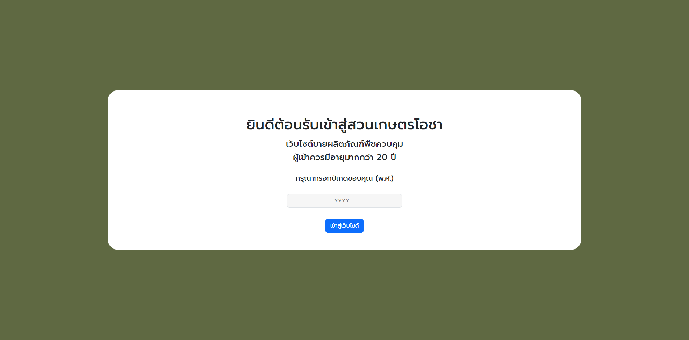
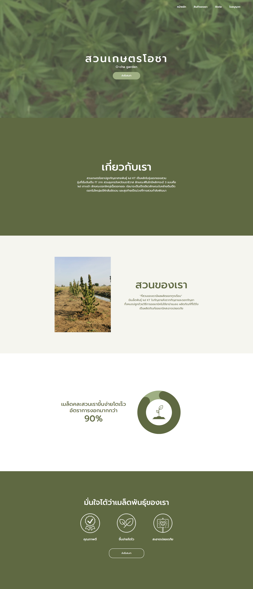
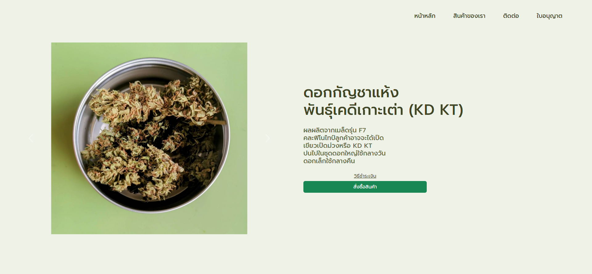
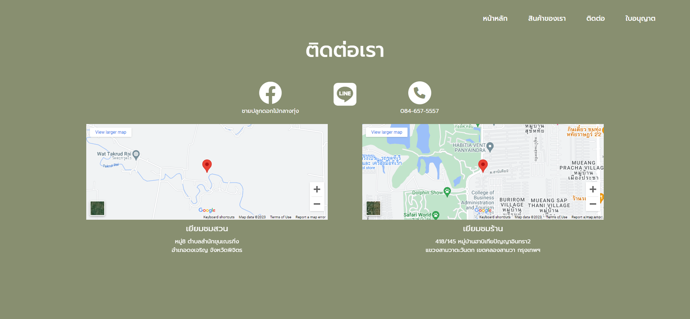
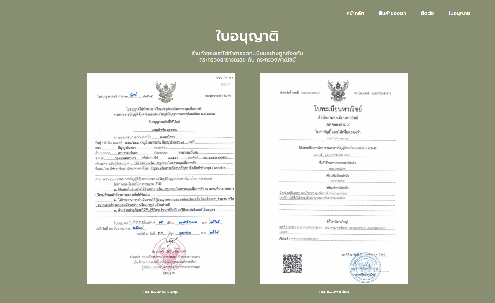

# ochagarden-nodejs
A cannabis farm website created from scratch, starting with the UX/UI design. The website is built using Node.js and the EJS template engine and features an age restriction that verifies if the user is older than 20 years old. The website provides detailed information about the farm and its products, showcasing my ability to create a full-stack web

to run the service you will need to install all of the package include in package.json
```
npm install
```

To run the website type :

```
npm start
```
or 
```
node app.js
```

Snapshot of the website :







